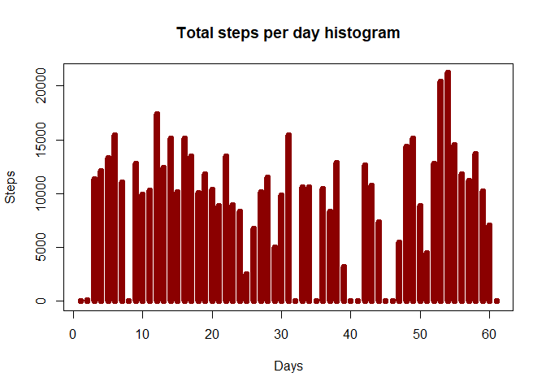
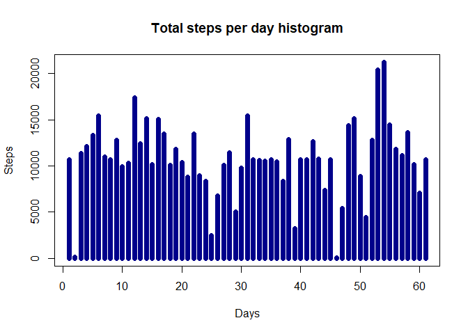
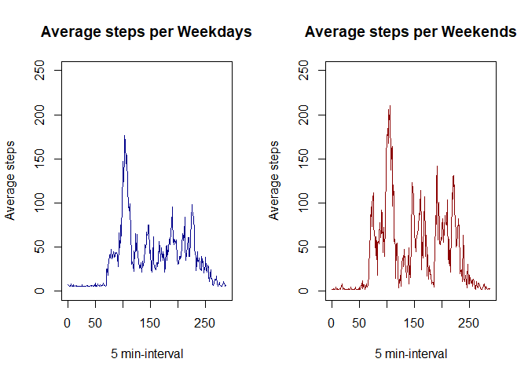

The global options are set to always echo the code of every codechunk and automatically save the figures.

```r
knitr::opts_chunk$set(echo=TRUE)

knitr::opts_chunk$set( fig.path = "figs/fig-")
```

## Loading and preprocessing the data

>The data is loaded and N/A values in the steps column are omitted as they could interfere with statistic analysis. The code chunk's result is cached.


```r
dataRaw<-read.csv("activity.csv")
data<-dataRaw[!is.na(dataRaw$steps),]
```

## What is mean total number of steps taken per day?
>We can see the total steps taken each day in the following histogram and the total mean and the median below it.


```r
#Total Steps per day histogram
stepsDay<-tapply(data$steps, data$date, sum)
stepsDay[is.na(stepsDay)]<-0
plot(stepsDay,type="histogram", lwd=8, col="dark red", xlab = "Days", ylab = "Steps", main = "Total steps per day histogram")
```

```
## Warning in plot.xy(xy, type, ...): plot type 'histogram' will be truncated
## to first character
```

<!-- -->

```r
  #Mean and median steps per day
options("scipen"=100, "digits"=4)
medianSteps<-median(as.vector(stepsDay))
meanSteps<-round(mean(as.vector(stepsDay)),digits = 2)
```

>The steps taken per day *Mean* is **9354.23**. The steps taken per day *Median* is **10395**.

## What is the average daily activity pattern?

>There are **288** 5 min-intervals per day. In the following linear plot we can see the average steps taken at each 5 min-interval accross all days.


```r
plot(tapply(data$steps, data$interval, mean),type = "l",col="darkblue", lwd=1, xlab ="Daily 5 min-interval",ylab = "Steps average", main = "Average of steps by 5 min-interval")
```

<!-- -->


## Imputing missing values


```r
countNA<-nrow(dataRaw[is.na(dataRaw$steps),] )
```

>There are **2304** missing values in the data set. In the following historgram we create a new data set with the missing values filled with the data's rounded mean value.


```r
data2<-dataRaw
data2$steps[is.na(data2$steps)]<-round(mean(dataRaw$steps[!is.na(dataRaw$steps)]))
stepsDay2<-tapply(data2$steps, data2$date, sum)

plot(stepsDay2,type="histogram", lwd=7, col="dark blue", xlab = "Days", ylab = "Steps", main = "Total steps per day histogram")
```

```
## Warning in plot.xy(xy, type, ...): plot type 'histogram' will be truncated
## to first character
```

<!-- -->

```r
#Mean and median steps per day
options("scipen"=100, "digits"=4)
medianSteps2<-median(as.vector(stepsDay2))
meanSteps2<-round(mean(as.vector(stepsDay2)),digits = 2)
```
>In this case the total mean is **10751.74** and the total median is **10656**. As compared to the values of the original data set we can see that the median value remains very similar with just a couple of hundred units of difference. However, the mean value is the one that has changed the most with more than 1 thousand units of difference.

## Are there differences in activity patterns between weekdays and weekends?


```r
#create new factor variable for weekdays and weekends
data2$weekday<-factor(data2,levels = c("weekend","weekday"))
data2[(weekdays(as.Date(data[,2]),abbreviate=T) %in% c("Sat","Sun")),]$weekday<-"weekend"
data2[is.na(data2$weekday),]$weekday<-"weekday"

#Creating the plot
par(mfrow=c(1,2))
with(data2, plot(tapply(data2[data2$weekday=="weekday",]$steps, data2[data2$weekday=="weekday",]$interval, mean), type="l", col="darkblue", main = "Average steps per Weekdays", xlab = "5 min-interval", ylab = "Average steps", ylim = c(0,250)))
with(data2, plot(tapply(data2[data2$weekday=="weekend",]$steps, data2[data2$weekday=="weekend",]$interval, mean), type="l", col="darkred", main = "Average steps per Weekends", xlab = "5 min-interval", ylab = "Average steps", ylim = c(0,250)))
```

<!-- -->
